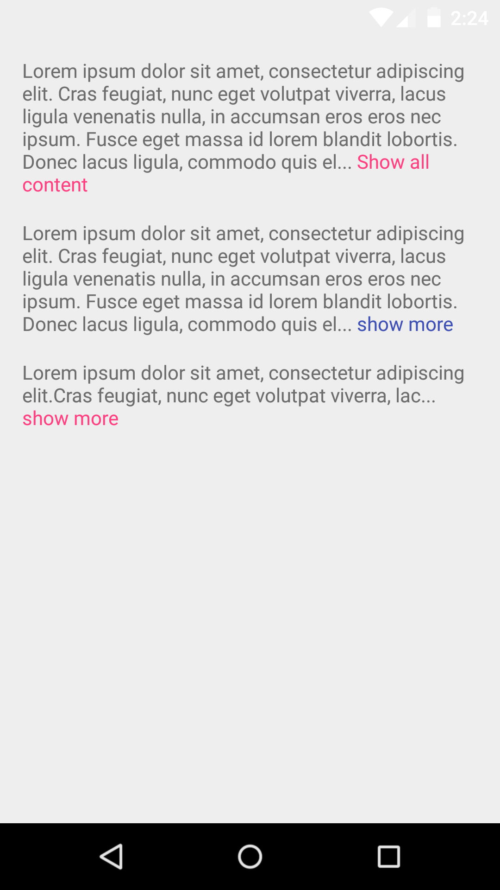
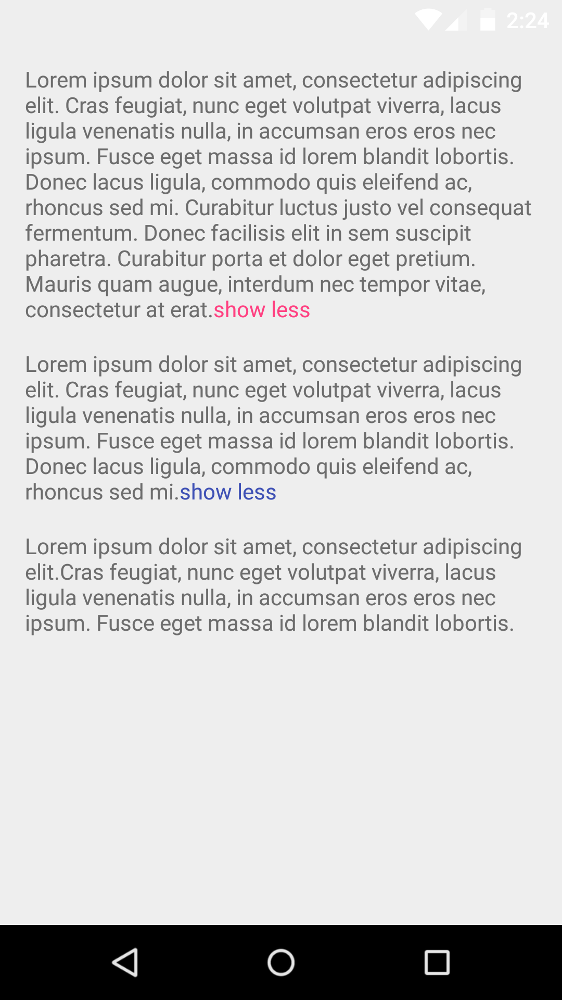

# ReadMoreTextView
[](https://travis-ci.org/borjabravo10/ReadMoreTextView)
[](https://android-arsenal.com/details/1/3473)
[](https://jitpack.io/#borjabravo10/ReadMoreTextView)

A Custom TextView with trim text

## Download
To add the ReadMoreTextView library to your Android Studio project, simply add the following gradle dependency:
```java
compile 'com.borjabravo:readmoretextview:2.0.1'
```

## Usage

To use the ReadMoreTextView on your app, add the following code to your layout:

```xml
<com.borjabravo.readmoretextview.ReadMoreTextView
    android:id="@+id/text_view"
    android:layout_width="match_parent"
    android:layout_height="wrap_content"/>
```    

You can customize ReadMoreTextView with:

- app:trimExpandedText: Text that appears when the view is expanded.
- app:trimCollapsedText: Text that appears when the view is collapsed.
- app:trimLength: Trim length to determine when the clickable text is displayed.
- app:showTrimExpandedText: Show the trim text if it's true. 
- app:colorClickableText: Text color of trim clickable text.
- app:trimMode: Choose trim mode with two options: trimModeLength or trimModeLines.

## Screenshots




License
=======

    Copyright 2016 Borja Bravo Álvarez

    Licensed under the Apache License, Version 2.0 (the "License");
    you may not use this file except in compliance with the License.
    You may obtain a copy of the License at

       http://www.apache.org/licenses/LICENSE-2.0

    Unless required by applicable law or agreed to in writing, software
    distributed under the License is distributed on an "AS IS" BASIS,
    WITHOUT WARRANTIES OR CONDITIONS OF ANY KIND, either express or implied.
    See the License for the specific language governing permissions and
    limitations under the License.
